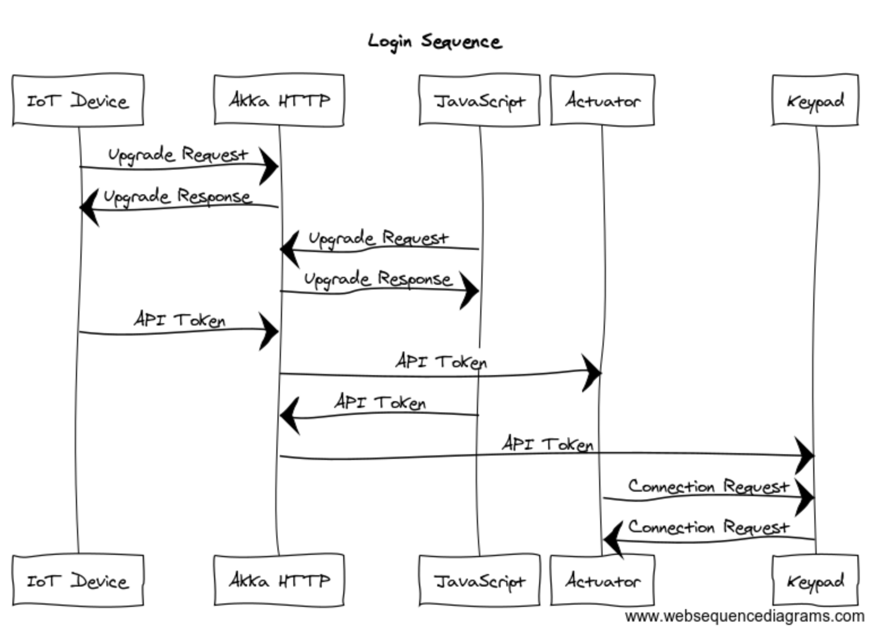
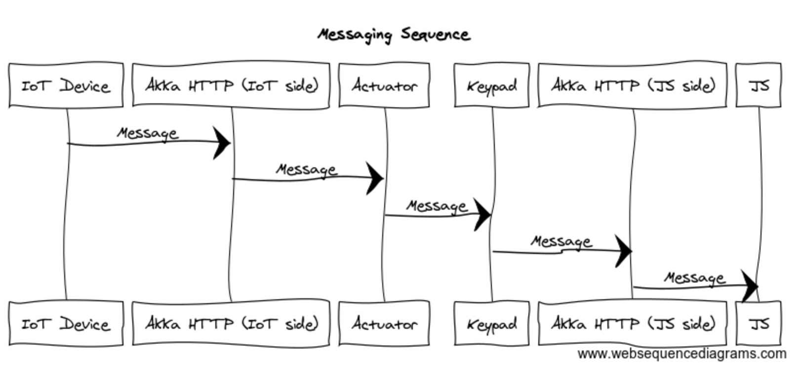

# WebSocket Relay Server

This repository provides the source code of the WebSocket API server application hosted on [Qoosky](https://www.qoosky.io/).  Users can connect their IoT devices such as Raspberry Pi, Arduino, and Android Things to the server using WebSocket with a pre-generated API token.  They can control their devices with the corresponding JavaScript WebSocket client of the same API token available at  https://www.qoosky.io/account/api/cc using their PC or smartphone browsers.  Qoosky API server relays WebSocket messages from IoT devices or JavaScript clients to the other corresponding clients in real-time.

Feel free to test this server application on your host, or fork it and customize to create some more interesting applications.

## Sequence diagram

WebSocket clients such as IoT devices and JavaScript applications upgrade their HTTP connections to communicate over the WebSocket protocol with Akka HTTP server.  Inside Akka HTTP server, there exist two types of actors: `Actuator` for IoT devices and `Keypad` for JavaScript applications.  An Actuator actor first send `ConnectionRequest` to Keypad actors, and a Keypad actor replies if it has the same API token as the Actuator actor.

Once an Actuator actor and a Keypad actor are connected, the IoT device and JavaScript application can send and receive WebSocket messages as if they were directly connected, but in fact there exists the Akka HTTP relay server.

## Languages

- [Scala 2.12.3](https://www.scala-lang.org)

## Toolkits

- [Akka 2.5.4](http://doc.akka.io/docs/akka/2.5.4/scala/)
- [Akka HTTP 10.0.9](http://doc.akka.io/docs/akka-http/10.0.9/scala/http/)

## How to build

Java 8 and [SBT](http://www.scala-sbt.org/) 0.13.16 or higher need to be installed.  You can test, run and build the application with the following commands.  No middleware is required.

Run unit tests

	sbt test

Run application at http://localhost:8080/

	sbt run

Build fat JAR

	sbt assembly
	java -jar target/scala-2.12/websocket_relay_server-assembly-1.0.jar

## License

The MIT License (MIT)

Copyright (c) 2017 Qoosky

Permission is hereby granted, free of charge, to any person obtaining a copy
of this software and associated documentation files (the "Software"), to deal
in the Software without restriction, including without limitation the rights
to use, copy, modify, merge, publish, distribute, sublicense, and/or sell
copies of the Software, and to permit persons to whom the Software is
furnished to do so, subject to the following conditions:

The above copyright notice and this permission notice shall be included in all
copies or substantial portions of the Software.

THE SOFTWARE IS PROVIDED "AS IS", WITHOUT WARRANTY OF ANY KIND, EXPRESS OR
IMPLIED, INCLUDING BUT NOT LIMITED TO THE WARRANTIES OF MERCHANTABILITY,
FITNESS FOR A PARTICULAR PURPOSE AND NONINFRINGEMENT. IN NO EVENT SHALL THE
AUTHORS OR COPYRIGHT HOLDERS BE LIABLE FOR ANY CLAIM, DAMAGES OR OTHER
LIABILITY, WHETHER IN AN ACTION OF CONTRACT, TORT OR OTHERWISE, ARISING FROM,
OUT OF OR IN CONNECTION WITH THE SOFTWARE OR THE USE OR OTHER DEALINGS IN THE
SOFTWARE.
