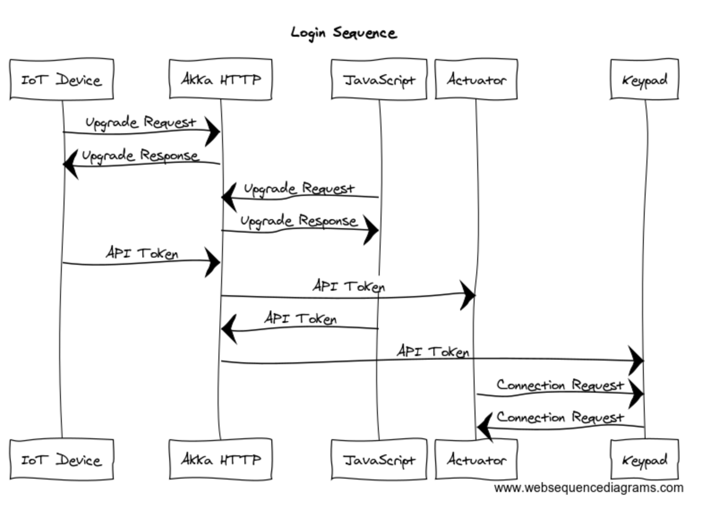
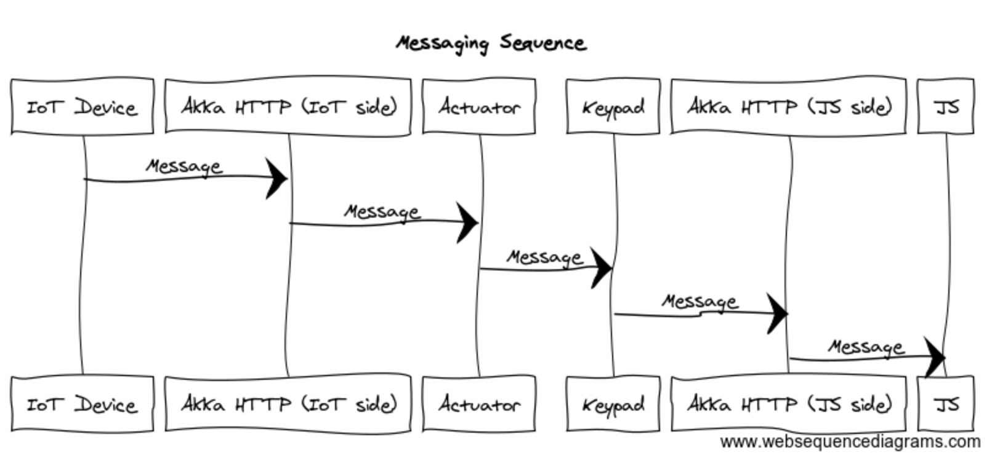

# WebSocket Relay Server

WebSocket Relay Server is an API application hosted on [Qoosky](https://www.qoosky.io/). Devices such as Raspberry Pi, Arduino, and Android Things can be controlled in real-time through the Internet using the API from PCs and smartphones.

- API token is required to connect to the server, which is available in this page: https://www.qoosky.io/account/api/cc
- WebSocket client samples are available here https://github.com/qoosky/websocket-clients

## Sequence diagrams

WebSocket clients such as the IoT devices and keypad JavaScript application upgrade their HTTP connections to communicate over the WebSocket protocol with Akka HTTP server. Inside Akka HTTP server, there exist two types of actors: `Actuator` for the IoT devices and `Keypad` for the JavaScript application. An Actuator actor first sends `ConnectionRequest` to the Keypad actors, and some Keypad actor replies if it has the same API token as the Actuator actor.

Once the Actuator actor and the Keypad actor are connected, they can send and receive WebSocket messages as if they were directly connected, but in fact there exists the intermediate Akka HTTP relay server.

## Languages

- [Scala 2.13.1](https://www.scala-lang.org)

## Toolkits

- [Akka 2.5.31](https://doc.akka.io//docs/akka/2.5.31/?language=scala)
- [Akka HTTP 10.1.11](https://doc.akka.io//docs/akka-http/10.0.9/scala/http/)

## How to build

Java 11 and [SBT](http://www.scala-sbt.org/) 1.3.4 or higher need to be installed. You can test, run, and build the application using the following commands. No middleware is required.

Run unit tests

	sbt test

Run application at http://localhost:8080/

	sbt run

Build fat JAR

	sbt assembly
	java -jar target/scala-2.13/websocket-relay-server-assembly-1.0.jar

## License

The MIT License (MIT)

Copyright (c) 2020 Qoosky

Permission is hereby granted, free of charge, to any person obtaining a copy
of this software and associated documentation files (the "Software"), to deal
in the Software without restriction, including without limitation the rights
to use, copy, modify, merge, publish, distribute, sublicense, and/or sell
copies of the Software, and to permit persons to whom the Software is
furnished to do so, subject to the following conditions:

The above copyright notice and this permission notice shall be included in all
copies or substantial portions of the Software.

THE SOFTWARE IS PROVIDED "AS IS", WITHOUT WARRANTY OF ANY KIND, EXPRESS OR
IMPLIED, INCLUDING BUT NOT LIMITED TO THE WARRANTIES OF MERCHANTABILITY,
FITNESS FOR A PARTICULAR PURPOSE AND NONINFRINGEMENT. IN NO EVENT SHALL THE
AUTHORS OR COPYRIGHT HOLDERS BE LIABLE FOR ANY CLAIM, DAMAGES OR OTHER
LIABILITY, WHETHER IN AN ACTION OF CONTRACT, TORT OR OTHERWISE, ARISING FROM,
OUT OF OR IN CONNECTION WITH THE SOFTWARE OR THE USE OR OTHER DEALINGS IN THE
SOFTWARE.
